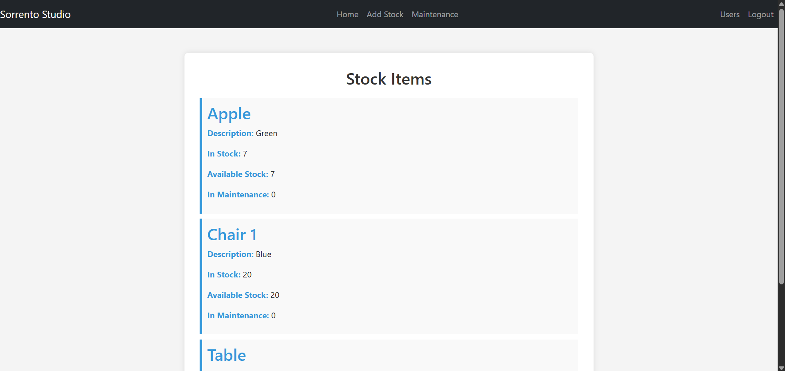
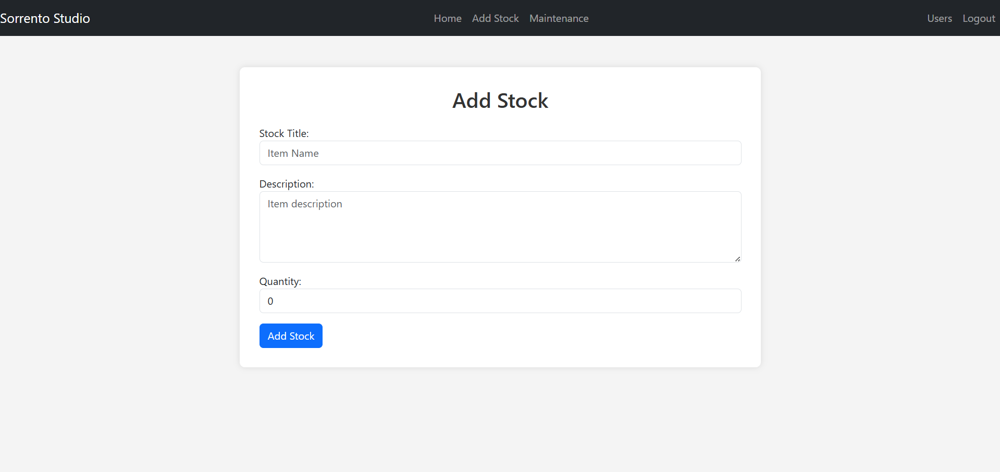
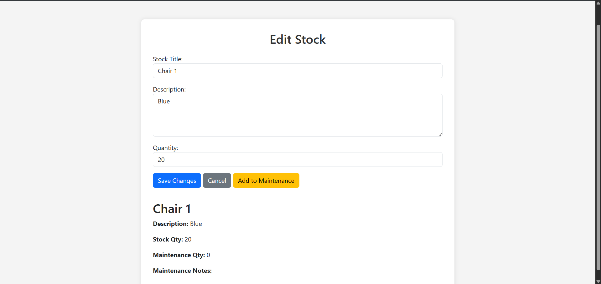
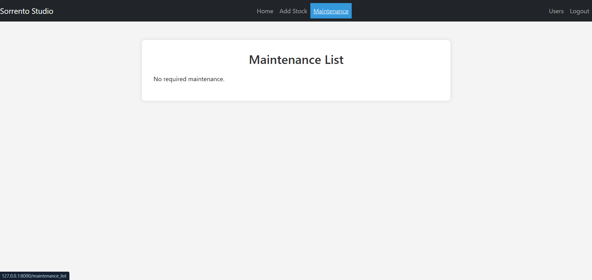
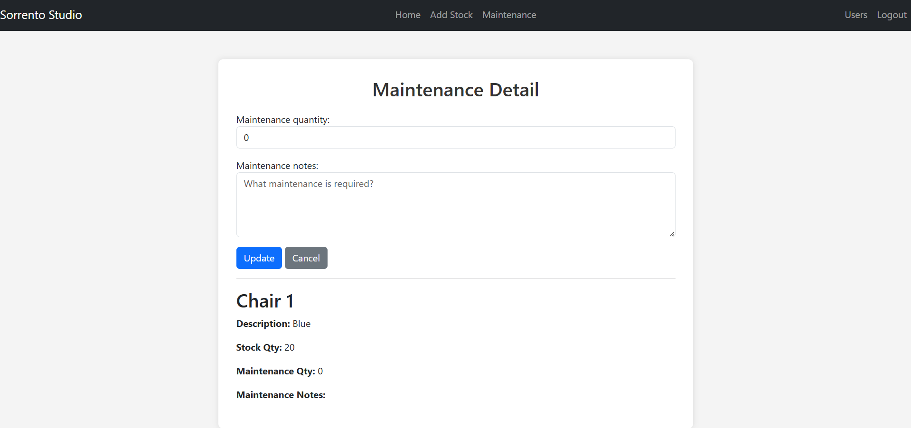

# my_stock_system

A Django-based web application for managing, tracking, and maintaining product inventory. Built with small businesses and personal projects in mind, this system allows users to add, edit, and monitor stock levels through a simple interface. It also includes a **stock maintenance** function to handle tasks such as restocking, auditing, and managing item statuses.

---

## Table of Contents

- [Features](#features)
- [Installation](#installation)
- [Usage](#usage)
- [Screenshots](#screenshots)
- [Credits](#credits)

---

## Features

- Add, edit, and delete stock items
- View inventory details at a glance
- Toggle product availability
- Perform stock maintenance operations
- Django admin integration

---

## Installation

To run this project locally:

### Prerequisites
- Python 3.x
- pip (Python package manager)
- Git

### Steps

```bash
# Clone the repo
git clone https://github.com/rxcardoalves/my-stock-system.git
cd my-stock-system

# Create virtual environment
python -m venv venv
source venv/bin/activate  # On Windows: venv\Scripts\activate

# Install dependencies
pip install -r requirements.txt

# Apply migrations
python manage.py migrate

# (Optional) Create superuser to access Django admin
python manage.py createsuperuser

# Start the development server
python manage.py runserver
```

---

## Usage

1. Open your browser and go to `http://127.0.0.1:8000/`
2. Log in if required (e.g., admin panel: `/admin`)
3. Use the interface to:
   - Add, edit, or delete stock items
   - View and search through the product list
   - Perform stock maintenance operations to keep inventory updated

---

## Screenshots

### Homepage / Stock Item List


### Add Stock View


### Edit Stock View


### Stock Maintenance List


### Stock Maintenance View


---

## Credits

Created with by [Rycardo Simões Alves](https://github.com/rxcardoalves)

---
